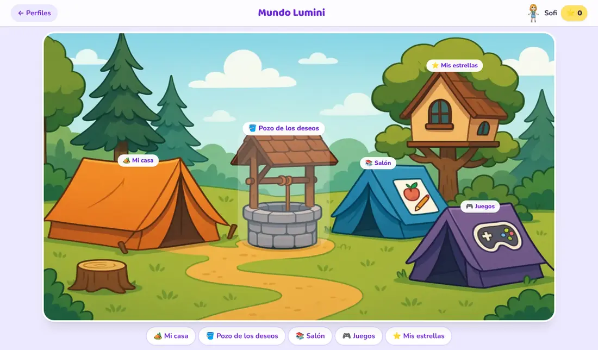
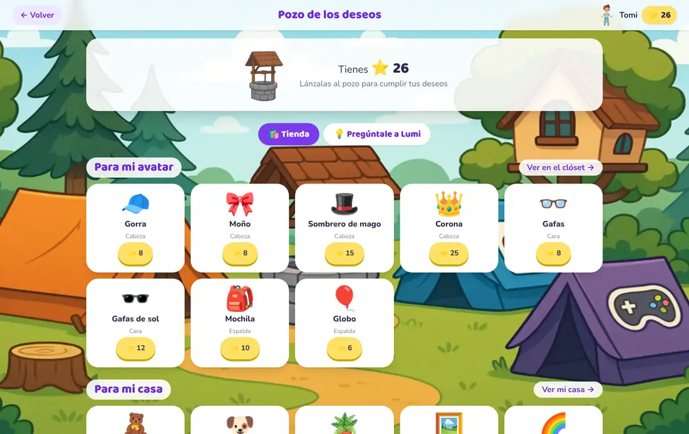
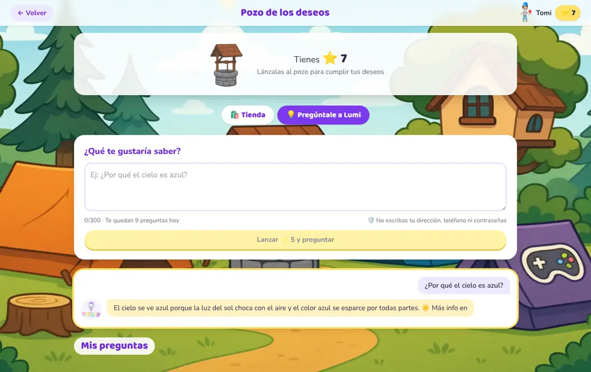
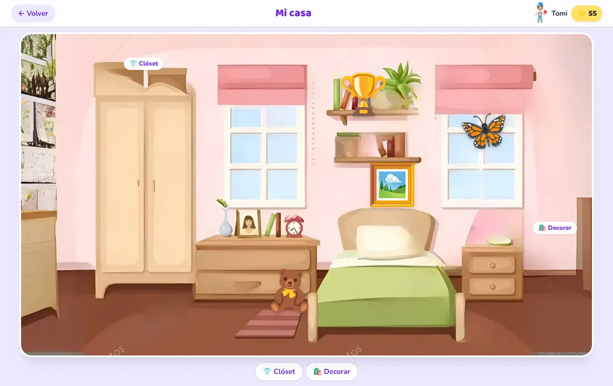
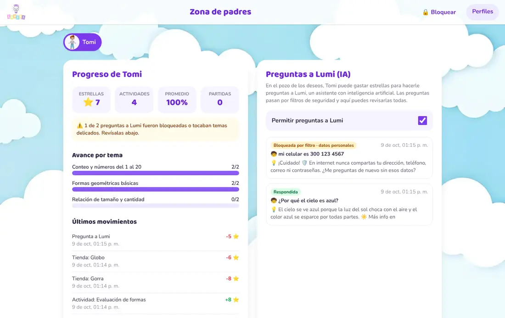
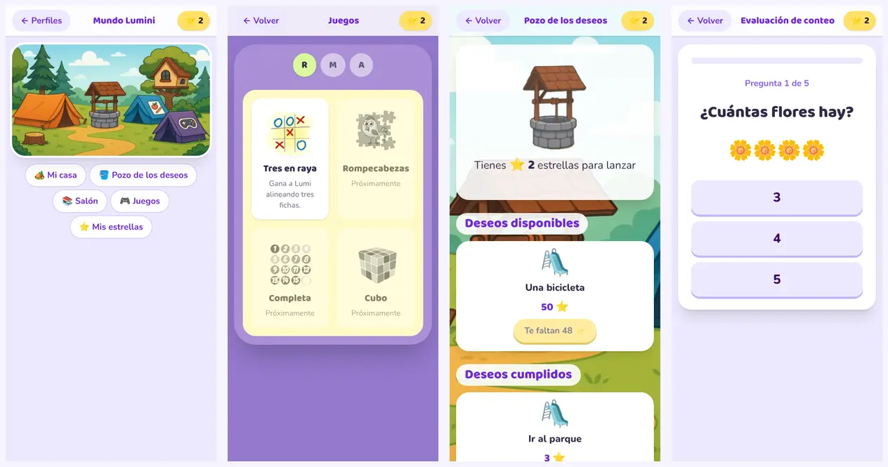
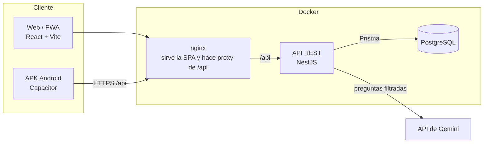
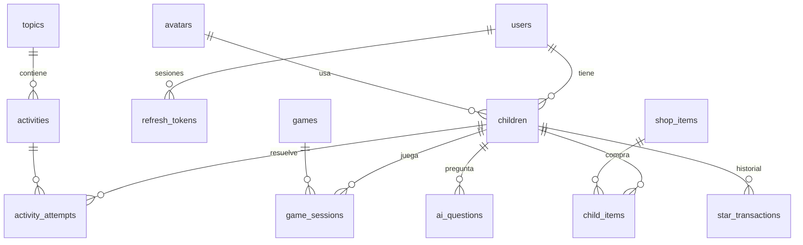

# Lumini

[](https://github.com/JuanZambrano15/lumini/actions/workflows/ci.yml)

Plataforma educativa para niños de 4 a 14 años. Los niños aprenden con actividades por tema, entrenan razonamiento, memoria y atención con juegos y ganan estrellas. Luego "lanzan" esas estrellas al **pozo de los deseos** para personalizar su avatar y su casa, o para hacerle preguntas a **Lumi**, un asistente con IA protegido por filtros de seguridad para niños.

Funciona como **web responsive**, como **PWA** y como **APK de Android** (con Capacitor), todo desde el mismo código.



## Funcionalidades

- **Cuentas de acudientes** con hasta 3 perfiles de niños, cada uno con su avatar.
- **Aprendizaje por temas**: tutorial paso a paso, actividades de práctica y evaluación. Las respuestas se califican en el servidor y nunca se envían al navegador.
- **Juegos** por categoría: tres en raya contra la computadora, cartas de memoria y "el pez diferente".
- **Estrellas**: se ganan al superar tu propio récord en una actividad o al jugar, con topes que evitan inflarlas. Cada movimiento queda en un historial.
- **Pozo de los deseos**:
  - **Tienda**: accesorios para el avatar y decoraciones para la casa.
  - **Pregúntale a Lumi**: preguntas a una IA (API de Gemini) con filtros de seguridad, activada por los padres y con historial visible para ellos.
- **Zona de padres** protegida con PIN: progreso por tema, promedio, actividad reciente, control de Lumi y gestión de perfiles.

| Tienda del pozo                  | Pregúntale a Lumi (IA)             |
| -------------------------------- | ---------------------------------- |
|  |      |
| **Casa decorada**                | **Zona de padres**                 |
|    |  |

<p align="center"></p>

## Arquitectura



- **`apps/api`**: API REST con NestJS 11, Prisma 7 y PostgreSQL 16. Concentra toda la lógica de negocio: autenticación, calificación, estrellas, tienda y la IA con sus filtros.
- **`apps/web`**: SPA con React 19, React Router, TanStack Query y Tailwind CSS 4. Solo maneja la interfaz y consume la API.
- **Seguridad**:
  - Contraseñas y PIN guardados con hash argon2.
  - Access token JWT de 15 minutos y refresh tokens opacos que rotan, con detección de reutilización.
  - Las acciones de padres exigen un token aparte que solo se obtiene con el PIN.
  - Cada petición verifica que el perfil pertenezca a la cuenta.
  - Rate limiting en login y PIN, helmet y validación de todas las entradas.
- **Datos sensibles**: la necesidad de apoyo (p. ej. TDAH) de un menor es un dato sensible según la Ley 1581 de 2012. Solo lo puede leer la cuenta dueña del perfil.

### Modelo de datos



El saldo de estrellas (`children.stars`) y su historial (`star_transactions`) se actualizan siempre en la misma transacción. Gastar estrellas usa un `UPDATE` condicional, así dos peticiones simultáneas no pueden dejar el saldo en negativo.

## Inicio rápido con Docker

Requisitos: Docker con Compose v2.

```sh
cp .env.example .env   # cambia las claves por valores aleatorios
docker compose up --build
```

- Web: http://localhost:8080
- Documentación de la API (Swagger): http://localhost:8080/api/docs

Al arrancar, la API aplica las migraciones y carga el contenido inicial (avatares, temas, actividades y juegos).

## Desarrollo local

```sh
pnpm install
cp .env.example .env && cp apps/api/.env.example apps/api/.env
docker compose up -d db                 # solo PostgreSQL
pnpm --filter @lumini/api db:deploy     # crea las tablas
pnpm --filter @lumini/api db:seed       # carga el contenido inicial
pnpm dev                                # API en :3000 y web en :5173
```

Para ver la base de datos: `pnpm --filter @lumini/api db:studio`. Guía completa, incluida la activación de Lumi, en [docs/desarrollo-local.md](docs/desarrollo-local.md).

### Scripts

| Comando                              | Qué hace                                           |
| ------------------------------------ | -------------------------------------------------- |
| `pnpm dev`                           | Levanta API y web con recarga en caliente          |
| `pnpm lint`                          | ESLint en todo el monorepo                         |
| `pnpm typecheck`                     | Verificación de tipos de TypeScript                |
| `pnpm test`                          | Tests unitarios (Jest en la API, Vitest en la web) |
| `pnpm format`                        | Formatea con Prettier                              |
| `pnpm --filter @lumini/api test:e2e` | Test de punta a punta contra PostgreSQL            |

## APK de Android

La web se empaqueta con [Capacitor](https://capacitorjs.com/). Requisitos: Android Studio y JDK 21.

```sh
cd apps/web
echo "VITE_API_URL=https://tu-api.com/api" > .env.production.local  # URL pública de la API
pnpm exec cap add android   # solo la primera vez
pnpm cap:sync               # compila la web y la copia al proyecto Android
pnpm cap:open               # abre Android Studio → Build → Build APK(s)
```

Agrega `capacitor://localhost` y `https://localhost` a `CORS_ORIGINS` de la API (ya vienen en el `.env.example`).

## Estructura

```
lumini/
├─ apps/
│  ├─ api/
│  │  ├─ prisma/          esquema y migraciones
│  │  ├─ src/
│  │  │  ├─ auth/         registro, login, refresh tokens
│  │  │  ├─ parent/       PIN y modo padres
│  │  │  ├─ children/     perfiles y resumen para padres
│  │  │  ├─ learning/     temas, actividades y calificación
│  │  │  ├─ games/        catálogo y partidas
│  │  │  ├─ shop/         tienda del pozo de los deseos
│  │  │  ├─ lumi/         preguntas a la IA y filtros de seguridad
│  │  │  ├─ stars/        libro mayor de estrellas
│  │  │  ├─ common/       guards, decoradores y filtros
│  │  │  └─ database/     seed con el contenido inicial
│  │  └─ test/            tests e2e
│  └─ web/
│     └─ src/
│        ├─ api/          cliente HTTP, tipos y hooks de datos
│        ├─ auth/         sesión, perfil activo y modo padres
│        ├─ components/   componentes reutilizables
│        └─ features/     una carpeta por sección de la app
├─ docs/                documentación técnica y decisiones (ADR)
├─ docker-compose.yml
└─ .github/              CI, plantillas de issues y PRs
```

## Documentación

La carpeta [`docs/`](docs/README.md) tiene la arquitectura, el modelo de datos, la API, el diseño de seguridad de la IA, el despliegue y las decisiones técnicas.

## Cómo contribuir

Ver [CONTRIBUTING.md](CONTRIBUTING.md): ramas, Conventional Commits y flujo de pull requests.

## Autores

- Nicoll Sofia Arevalo Caballero (192316)
- Juan José Zambrano Manzano (192327)
