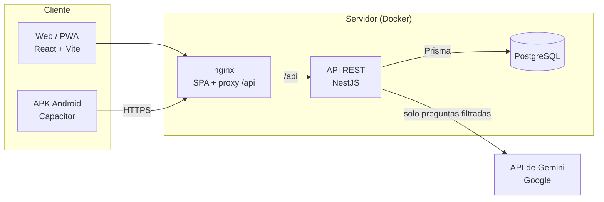

# Arquitectura



## Principio central

**El frontend solo muestra; la API decide.** La versión anterior hacía todo en el navegador contra Firebase: calificaba, guardaba la contraseña de padres en texto plano y cualquiera podía manipular sus datos desde las herramientas del navegador. Ahora toda regla de negocio vive en la API:

- La calificación de actividades (las respuestas correctas nunca llegan al navegador).
- Cuántas estrellas se ganan y se gastan.
- La verificación del PIN de padres.
- Los filtros de seguridad de la IA.

## Monorepo

```
apps/api   → NestJS: un módulo por dominio (auth, children, learning, games, shop, lumi…)
apps/web   → React: una carpeta por sección en src/features
docs/      → esta documentación
```

Se usa un monorepo con **pnpm workspaces**: un solo `pnpm install`, una sola CI y cambios de API y web en el mismo PR.

## Cómo viaja una petición

Ejemplo: el niño termina una actividad.

1. La web envía `POST /api/children/:childId/activities/:id/attempts` con sus respuestas y el access token.
2. **ThrottlerGuard** limita la cantidad de peticiones por IP.
3. **JwtAuthGuard** valida el token e identifica a la cuenta.
4. **ChildAccessGuard** verifica que el perfil pertenezca a esa cuenta (si no, responde 404).
5. **ValidationPipe** valida el cuerpo con el DTO.
6. `LearningService` califica y, en una transacción, guarda el intento y suma las estrellas.
7. La web invalida su caché de TanStack Query y muestra el nuevo saldo.

Las rutas de padres añaden **ParentModeGuard**, que exige el token que solo se obtiene con el PIN.

## Frontend

- **Datos del servidor**: TanStack Query (caché, reintentos e invalidación). No hay estado global duplicado.
- **Sesión**: `src/api/client.ts` adjunta el token y lo renueva solo cuando expira.
- **Escenas**: las zonas clicables usan porcentajes sobre una imagen 16:9, así funcionan en cualquier pantalla.
- **Un solo código para web y APK**: build estático que Capacitor empaqueta.
