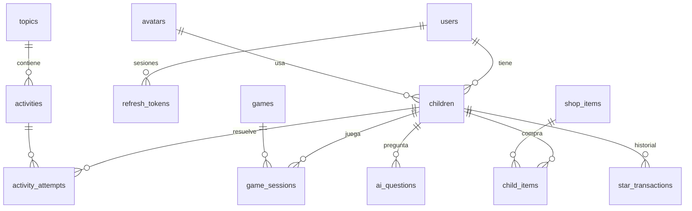

# Base de datos

Lumini usa **PostgreSQL 16** con **Prisma 7** como ORM. El esquema está en [`apps/api/prisma/schema.prisma`](../apps/api/prisma/schema.prisma) y cada cambio se aplica con una migración versionada en `apps/api/prisma/migrations/`.

## ¿Por qué relacional y no Firebase?

Los datos de Lumini son muy relacionales: una cuenta tiene niños, los niños tienen intentos, partidas, compras y preguntas, y todo apunta a catálogos (temas, juegos, objetos). PostgreSQL permite:

- **Integridad**: llaves foráneas y borrados en cascada (al borrar un perfil desaparece todo su progreso).
- **Transacciones**: gastar estrellas y registrar la compra pasa todo junto o no pasa.
- **Consultas** de progreso y estadísticas sin descargar colecciones enteras.

Ver también [ADR 0002](decisiones/0002-postgresql-y-prisma.md).

## Modelo

| Tabla                       | Qué guarda                                                             |
| --------------------------- | ---------------------------------------------------------------------- |
| `users`                     | Cuenta del acudiente: email, hash de contraseña y hash del PIN         |
| `refresh_tokens`            | Hash de cada sesión abierta (para poder cerrarlas)                     |
| `children`                  | Perfiles (máx. 3 por cuenta): avatar, estrellas, si Lumi está activado |
| `avatars`                   | Catálogo de personajes                                                 |
| `topics`, `activities`      | Contenido educativo; las preguntas se guardan como JSON validado       |
| `activity_attempts`         | Cada intento: aciertos, total y estrellas ganadas                      |
| `games`, `game_sessions`    | Catálogo de juegos y cada partida jugada                               |
| `shop_items`, `child_items` | Tienda del pozo y lo que cada niño compró y tiene equipado             |
| `ai_questions`              | Preguntas a Lumi con su respuesta y resultado de los filtros           |
| `star_transactions`         | Libro mayor: cada estrella ganada o gastada, con motivo                |

## Reglas de consistencia

- `children.stars` es el saldo y `star_transactions` su historial. Solo `StarsService` los modifica, siempre juntos y dentro de una transacción.
- Gastar estrellas usa un `UPDATE … WHERE stars >= costo`, así dos peticiones simultáneas no pueden dejar el saldo en negativo.

## Crear una migración

1. Edita `schema.prisma`.
2. Ejecuta `pnpm --filter @lumini/api db:migrate` y ponle un nombre descriptivo (`add_child_birth_year`).
3. Revisa el SQL generado y haz commit del esquema **y** de la carpeta de la migración.

Nunca modifiques una migración que ya se subió a `main`: crea una nueva.

## Contenido inicial (seed)

`apps/api/src/database/seed-data.ts` contiene avatares, temas, actividades, juegos y objetos de la tienda. El seed es idempotente: se ejecuta en cada arranque de la API en Docker y actualiza los registros por su `slug`. Para agregar contenido basta con editar ese archivo.
