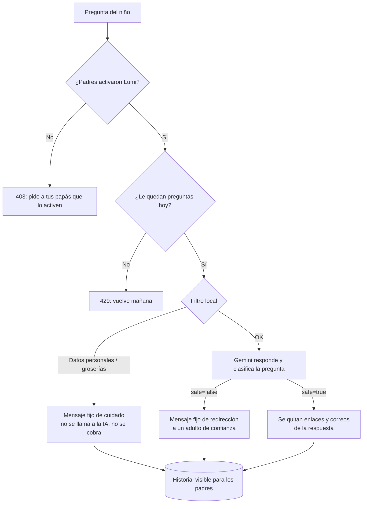

# IA y seguridad infantil

Lumi usa la **API de Gemini** (Google, SDK oficial `@google/genai`) para responder preguntas de niños de 4 a 14 años. Como los usuarios son menores, la función está diseñada con varias capas de protección y con los padres en control.

## Capas de seguridad

1. **Permiso de los padres**: viene apagado y se activa por perfil desde la Zona de padres (requiere PIN).
2. **Límites**: máximo de preguntas diarias por niño y rate limiting por IP.
3. **Filtro local** (`apps/api/src/lumi/content-filter.ts`): antes de enviar nada a la IA bloquea correos, teléfonos, direcciones, enlaces, menciones a contraseñas y groserías. Esos datos **nunca salen del servidor**.
4. **Prompt de sistema para niños**: lenguaje sencillo, máximo 120 palabras, sin enlaces ni datos personales, y la orden de ignorar instrucciones escondidas en la pregunta (protección contra _prompt injection_). La pregunta va dentro de `<pregunta>` para separarla de las instrucciones.
5. **Clasificación estructurada**: en la misma llamada, Gemini devuelve `{ safe, category, answer }` como JSON con un esquema (`responseJsonSchema`), que además se valida con zod al recibirlo. Si `safe` es falso, **no se muestra la respuesta de la IA** sino un mensaje fijo escrito por nosotros. En temas de autolesión se recomienda hablar con un adulto y la Línea 141 del ICBF.
6. **Filtro de salida**: se quitan enlaces y correos de la respuesta y se limita su largo.
7. **Transparencia**: toda pregunta y respuesta, incluidas las bloqueadas, queda en el historial que los padres revisan. El resumen los alerta si hubo preguntas delicadas.

## Qué datos se envían a la IA

Solo el texto de la pregunta ya filtrado. **No** se envía el nombre del niño, su edad, su cuenta ni ningún identificador.

## Configuración

| Variable             | Por defecto             | Descripción                                                  |
| -------------------- | ----------------------- | ------------------------------------------------------------ |
| `GEMINI_API_KEY`     | vacío                   | Sin clave, Lumi queda desactivado y la app sigue funcionando |
| `LUMI_MODEL`         | `gemini-3.1-flash-lite` | Modelo de Gemini                                             |
| `LUMI_QUESTION_COST` | `5`                     | Estrellas por pregunta                                       |
| `LUMI_DAILY_LIMIT`   | `10`                    | Preguntas por niño cada 24 horas                             |

- **Modelo**: `gemini-3.1-flash-lite`, de la línea más económica de Gemini, suficiente para preguntas cortas de niños. Se puede cambiar con `LUMI_MODEL` sin tocar código (los modelos disponibles están en [Google AI Studio](https://aistudio.google.com)).
- **Filtros propios de Gemini**: además de los nuestros, se configuran sus `safetySettings` en el nivel más estricto (`BLOCK_LOW_AND_ABOVE`) para acoso, odio, contenido sexual y contenido peligroso. Si Gemini bloquea la pregunta o la respuesta, Lumi muestra el mensaje fijo de redirección.

## Limitaciones conocidas

- La lista de groserías es corta a propósito: los casos sutiles los cubre la IA.
- El filtro de teléfonos bloquea cualquier número de 7 o más dígitos, lo que puede afectar preguntas de matemáticas con números muy grandes.
- Ningún filtro es perfecto: por eso existe el historial para padres y la función viene apagada.

## Cómo se prueba

- `content-filter.spec.ts`: casos de datos personales, groserías y limpieza de respuestas.
- `lumi.service.spec.ts`: permisos, límite diario, bloqueo sin cobro, redirección y devolución de estrellas si la IA falla (con la IA simulada).
- Para probar contra un servidor propio o simulado, el SDK respeta la variable `GOOGLE_GEMINI_BASE_URL`.
- El test e2e verifica que Lumi exige el PIN para activarse y que el filtro local no cobra.
